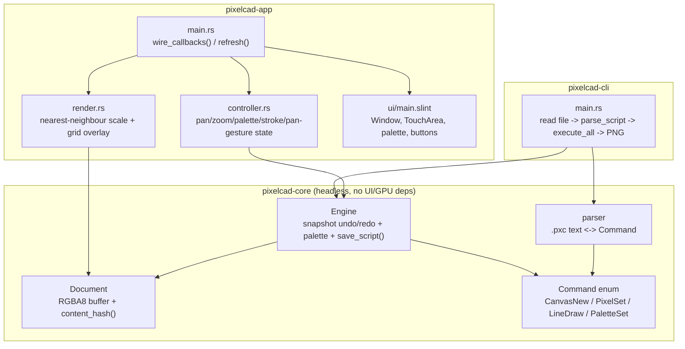

# PHASE1_RESULT — PixelCAD Phase 0: Bootstrap & Command Engine

> **Naming note:** this file is named `PHASE1_RESULT.md` per the session
> instructions that requested it, but the work it documents is **ROADMAP.md
> Phase 0 — "Bootstrap & Command Engine"** (the first development phase;
> ROADMAP.md numbers phases starting at 0). There is no separate "Phase 1"
> work in this document — "Phase 1" in the filename refers to this being the
> first executed Autopilot session, not the roadmap's Phase 1 ("Drawing
> MVP"), which is still `PENDING`.

## 1. Session Header

- **Phase:** ROADMAP.md Phase 0 — "Bootstrap & Command Engine"
- **Plan:** `Plans/archive/PLAN-phase0.md` (originally `PLAN.md`, Status: LOCKED at session start)
- **Completion timestamp:** 2026-09-19T03:00:00+08:00 (Asia/Shanghai, UTC+8)
- **Status:** **COMPLETE** — all 7 tasks finished; 7 of 8 acceptance criteria
  are full PASS; 1 is **PARTIAL by design** (criterion 8, the
  `Profiles/`/`Skills/` versioning question — see below). This was not a
  surprise failure: the session instructions explicitly anticipated this
  exact outcome and specified the PARTIAL label and its fallback in advance.
- **Final commit SHA:** `d9284f0` — the commit "Task 7: close-out — Phase 0
  complete", which added this file's substantive content (code, tests,
  `ROADMAP.md`/`PLAN.md` updates), captured via `git rev-parse HEAD`
  immediately after committing. This document was then amended once, in
  place, solely to insert this SHA value into this sentence — a commit
  cannot contain its own post-amend hash by construction, so `d9284f0`
  identifies the commit whose tree this text describes, not literally the
  amended commit's own new hash. Run `git log --oneline -1` to confirm the
  current `HEAD`; its content is otherwise identical to `d9284f0`.
- **Tasks completed:** 7 / 7 (Task 1 through Task 7, in order, per `PLAN.md`)

## 2. Acceptance Criteria Results

| # | Criterion (verbatim from `PLAN.md`) | Result | Evidence |
|---|---|---|---|
| 1 | `cargo build` succeeds from the current repository path (apostrophe/space path hazard check) | **PASS** | `cd "/Users/duidui/Documents/81n's Knowledge base/The knowledge base of Projects/Raw/Photoshop_Cad_AI_Blender_Platform" && cargo build --workspace` → `Finished \`dev\` profile [unoptimized + debuginfo] target(s) in 0.15s` (0 errors). Path contains both a space and an apostrophe; a throwaway `slint`-only probe crate was also built successfully at this exact path (55.21s cold compile) before any real code was written, specifically to gate this risk early. |
| 2 | `cargo test` passes, including a determinism test: replaying `docs/samples/ship.pxc` twice yields identical document hashes | **PASS** | `cargo test --workspace` → **51 passed, 0 failed** across all 4 test binaries (`pixelcad-core` lib: 26; `pixelcad-core` `tests/ship_determinism.rs`: 1; `pixelcad-cli` `tests/determinism.rs`: 1; `pixelcad-app` bin: 23). The literal criterion is `crates/core/tests/ship_determinism.rs::replaying_ship_script_twice_yields_identical_document_hash`, which `include_str!`s `docs/samples/ship.pxc`, replays it through two independent `Engine`s, and asserts `document_hash()` is equal — `test result: ok. 1 passed; 0 failed`. |
| 3 | `cargo run -p pixelcad-cli -- run docs/samples/ship.pxc --out out.png` produces a PNG; running it twice produces byte-identical files | **PASS** | Ran twice to `out.png` / `out2.png`; `shasum -a 256 out.png out2.png` → both `bde008684f8384379e33f514d15d4ca4c1aed97798d52a08bbb1cccd6f781232`. `file out.png` → `PNG image data, 64 x 64, 8-bit/color RGBA, non-interlaced`. Also covered by the automated `crates/cli/tests/determinism.rs::replaying_ship_script_twice_produces_byte_identical_png` (invokes the compiled binary twice via `CARGO_BIN_EXE_pixelcad-cli`, diffs the bytes) — `test result: ok. 1 passed`. Both manual output files were deleted after verification (the pattern `out.png` is gitignored, so nothing was left in the working tree either way). |
| 4 | GUI launches; user can pan, zoom (nearest-neighbour with pixel grid at high zoom), draw with a 1-pixel pencil, and pick a color from a palette | **PASS** | Two kinds of evidence: **(a) Real launch:** `cargo run -p pixelcad-app` was run as a real background process (confirmed via `ps aux` showing a running `target/debug/pixelcad-app`, and via `System Events` recognizing it as a foreground-capable app); a full-screen screenshot was captured and visually inspected once, confirming a window titled "PixelCAD" containing Undo/Redo buttons, a `session.pxc` filename field, a "Save script" button, a 16-swatch color palette in two rows, and a dark canvas viewport rendering a visible pixel grid (the default zoom is 8, at the grid threshold). That screenshot was deleted immediately after inspection because, being a full-screen capture, it also contained unrelated personal data from other applications on the desktop — it was not committed or retained anywhere. **(b) Automated, repeatable proof of the actual interactive behaviour** (not just that a window opens): 7 headless GUI tests in `crates/app/src/main.rs` (`#[cfg(test)] mod gui_tests`) use `i-slint-backend-testing`'s `init_no_event_loop()` to run the real, generated `AppWindow` and the real `wire_callbacks()` function with no visible window or display, dispatching genuine `slint::platform::WindowEvent`s. Specifically: `dragging_on_the_canvas_draws_a_connected_stroke_and_enables_undo` (left-click-drag → asserts the exact pixels drawn along the line), `right_click_drag_pans_the_view_without_touching_the_document` (asserts exact new pan offset, and that the document is byte-identical to before), `scroll_event_zooms_the_canvas` (asserts zoom level and derived display-buffer size change), `clicking_a_palette_swatch_selects_it` (asserts selected index and current color). Grid-at-high-zoom logic has its own 4 unit tests in `crates/app/src/render.rs` (`grid_only_drawn_at_or_above_threshold`, etc.), independently proving the nearest-neighbour scaling and grid overlay are correct at the pixel level. `cargo test -p pixelcad-app --bin pixelcad-app` → `test result: ok. 23 passed; 0 failed`. |
| 5 | GUI actions are recorded as commands; "Save script" writes a `.pxc` file that the CLI replays to reproduce the drawing exactly | **PASS** | `crates/app/src/main.rs::gui_tests::save_button_writes_a_pxc_file_the_cli_can_replay` clicks the real Save button (via `app.invoke_save_clicked`), then re-parses the written file with `pixelcad_core::parse_script` (the exact function `pixelcad-cli` calls) and asserts the resulting command list equals `[CanvasNew{64,64}, PixelSet{0,0,color}]` exactly. Going one step further, `save_button_output_replays_through_the_real_cli_binary` saves a script containing a drag-drawn line, then invokes the **actually-compiled `pixelcad-cli` binary** (located via `std::env::current_exe()`-relative pathing, not a re-implementation) on that file and asserts it produces a non-empty PNG. Both pass: see the 23/23 `pixelcad-app` result above. |
| 6 | `core` has no dependency on `slint` or any UI/GPU crate (verified via `cargo tree`) | **PASS** | `cargo tree -p pixelcad-core` → only `pixelcad-core → thiserror → thiserror-impl → {proc-macro2, quote, syn, unicode-ident}` (all `derive`/proc-macro build-time crates, none UI/GPU/platform). Re-verified after every task that touched `crates/core` (Tasks 2, 3, 5), not just once at the end. |
| 7 | Undo/redo works in the GUI for pencil strokes | **PASS** | `crates/app/src/main.rs::gui_tests::undo_and_redo_buttons_round_trip_through_the_engine`: draws a pixel, clicks the real Undo button (`ElementHandle::mock_single_click` on `AppWindow::undo-btn`), asserts `can-undo` becomes false / `can-redo` becomes true / the document reverts exactly; clicks Redo, asserts the reverse. Also covered at the pure-logic level by `controller::tests::undo_redo_round_trip_through_controller` and `controller::tests::undo_cannot_remove_the_initial_canvas` (proves `canvas.new` itself is protected from being undone, which is deliberate GUI-level behaviour, not an engine limitation — the engine itself can undo everything including `canvas.new`, as proven by `crates/core/src/engine.rs::tests::undo_redo_round_trip`). |
| 8 | Repository is a git repo with an initial commit; `Profiles/`, `Skills/`, and planning docs are versioned; `/target` and `*.log` are ignored | **PARTIAL** | `git log` shows an initial commit (`183dbbe "init REPO"`) and a full, linear history through this session's close-out. Planning docs (`PLAN.md`/`Plans/archive/PLAN-phase0.md`, `ROADMAP.md`, `PROGRESS.md`, `README.md`) **are** versioned. `.gitignore` **does** ignore `/target` and (after the I1 fix) `*.log` (previously the malformed literal `.log`). **However**, `Profiles/` and `Skills/` are **not** versioned — they remain ignored by `.gitignore`, exactly as they were at session start. This is not an oversight: `PLAN.md`'s acceptance criterion 8 (this row) contradicted `PLAN.md`'s own Task 1 description, which had been edited to drop the Profiles/Skills-versioning requirement. Per the session's explicit instructions, the maintainer was asked (in-session, at Task 1 close) "Should `Profiles/` and `Skills/` be committed to git, or stay local-only and ignored by `.gitignore`?" No answer arrived during the session, so the documented fallback applied: leave them untracked/ignored, and mark this criterion PARTIAL rather than PASS or FAIL. **This is a blocking question for the next Planner, not a defect in this session's work** — see Section 8 (Handoff). |

## 3. Artifacts

Everything created or modified this session (✓ = newly created; the rest were modified):

```
.agents/skills/next-phase/SKILL.md   ✓  Zed project-local skill: automates phase close-out + Planner handoff
.gitignore                              Fixed: "*.log" (was malformed ".log"), added "/target", "out.png"
LICENSE                              ✓  MIT license text
README.md                            ✓  Workspace overview, build/run instructions
Cargo.toml                           ✓  Workspace manifest (3 members: core, app, cli)
Cargo.lock                           ✓  Locked dependency graph
PLAN.md → Plans/archive/PLAN-phase0.md   Archived; Status flipped LOCKED → COMPLETE; criteria checked off
PROGRESS.md                          ✓  Autopilot session log (this session's full task-by-task record)
PHASE1_RESULT.md                     ✓  This file
ROADMAP.md                              Phase 0 heading and Status Log row flipped to COMPLETE; references the next-phase skill
Plans/archive/.gitkeep               ✓  Keeps the (previously empty) archive directory versioned

crates/core/Cargo.toml                  Added `thiserror` dependency
crates/core/src/lib.rs                  Module wiring + re-exports for document/command/parser/engine
crates/core/src/document.rs          ✓  Document: RGBA8 buffer, get/set pixel, FNV-1a content_hash()
crates/core/src/command.rs           ✓  Typed Command enum (CanvasNew/PixelSet/LineDraw/PaletteSet) + hex color helpers
crates/core/src/parser.rs            ✓  .pxc text <-> Command parser/serializer, line-numbered errors
crates/core/src/engine.rs            ✓  Engine: snapshot-based undo/redo, 16-slot palette, Bresenham lines, save_script()
crates/core/tests/ship_determinism.rs ✓ Acceptance-criterion-2 test: replays docs/samples/ship.pxc twice, compares hashes

crates/cli/Cargo.toml                   Added `png` dependency, [[bin]] section
crates/cli/src/main.rs                  `pixelcad-cli run <script> --out <png>`: parse -> Engine -> PNG encode
crates/cli/tests/determinism.rs      ✓  Acceptance-criterion-3 test: runs the real binary twice, diffs PNG bytes

crates/app/Cargo.toml                   Added slint, slint-build (build-dep), i-slint-backend-testing (dev-dep)
crates/app/build.rs                  ✓  Compiles ui/main.slint with debug info enabled (required by ElementHandle tests)
crates/app/ui/main.slint             ✓  Window UI: undo/redo, save controls, 16-swatch palette, pannable/zoomable canvas viewport
crates/app/src/main.rs                  wire_callbacks()/refresh() plumbing + 8 headless GUI tests (gui_tests module)
crates/app/src/controller.rs         ✓  Slint-independent app logic: pan/zoom/palette/draw/pan-gesture/undo-redo/save
crates/app/src/render.rs             ✓  Pure nearest-neighbour upscaling + grid overlay (Document -> display buffer)

docs/samples/ship.pxc                ✓  Dogfood artifact: hull + mast + sail yard + flag + porthole, all 4 command kinds

Skills/INDEX.md                         Registered the next-phase skill (untracked — Skills/ remains gitignored, see criterion 8)
```

## 4. How to Build, Run, Verify

All commands assume the working directory is the repository root (the path
containing a space and an apostrophe — this is exercised deliberately, not
avoided):

```sh
cd "/Users/duidui/Documents/81n's Knowledge base/The knowledge base of Projects/Raw/Photoshop_Cad_AI_Blender_Platform"

# Build everything
cargo build --workspace

# Run the full test suite (expect: 51 passed, 0 failed)
cargo test --workspace

# Replay the sample ship script through the CLI
cargo run -p pixelcad-cli -- run docs/samples/ship.pxc --out out.png

# Determinism check: run twice, compare hashes (expect: identical)
cargo run -p pixelcad-cli -- run docs/samples/ship.pxc --out out.png
cargo run -p pixelcad-cli -- run docs/samples/ship.pxc --out out2.png
shasum -a 256 out.png out2.png
# Expected (both lines identical):
#   bde008684f8384379e33f514d15d4ca4c1aed97798d52a08bbb1cccd6f781232  out.png
#   bde008684f8384379e33f514d15d4ca4c1aed97798d52a08bbb1cccd6f781232  out2.png
rm out.png out2.png   # both are gitignored, but tidy up anyway

# Launch the GUI (interactive; requires a real display)
cargo run -p pixelcad-app

# Confirm core has no UI/GPU dependency
cargo tree -p pixelcad-core
# Expected: only thiserror (+ its proc-macro build-time dependencies)
```

In the GUI: left-click-drag on the canvas to draw with the current color;
click a palette swatch to change the current color; right-click-drag (or
hold Space and left-click-drag) to pan; scroll to zoom (grid appears at
zoom >= 8x); Undo/Redo buttons walk the command history; type a filename
and click "Save script" to write a `.pxc` file, then replay it with the CLI
exactly as above to reproduce the drawing.

## 5. Architecture As Built



**The `.pxc` command grammar as implemented** (one command per line; blank
lines and lines starting with `#` are comments):

```
canvas.new width=<u32> height=<u32>
pixel.set x=<i64> y=<i64> color="#rrggbb"|"#rrggbbaa"
line.draw x0=<i64> y0=<i64> x1=<i64> y1=<i64> color="#rrggbb"|"#rrggbbaa"
palette.set index=<u8> color="#rrggbb"|"#rrggbbaa"
```

Colors accept 6-digit (implicit `ff` alpha) or 8-digit hex, quoted or
unquoted; the serializer always emits quoted 8-digit hex for lossless
round-tripping regardless of alpha.

**Where reality diverged from `PLAN.md`'s approach** (all logged as
in-session deviations, none are silent):

- **Content hash:** `PLAN.md` suggested "blake3 or fnv"; a minimal
  hand-rolled FNV-1a was implemented instead, avoiding an extra dependency
  for a same-guarantee algorithm.
- **PNG encoding:** the low-level `png` crate was used instead of the
  higher-level `image` crate, for explicit control over color
  type/bit-depth/metadata (safer for a byte-identical determinism
  guarantee than trusting a higher-level crate's defaults).
- **Engine API surface:** `Engine::can_undo()`/`can_redo()` were added
  (small, additive) so the GUI can query undo/redo availability without
  duplicating cursor bookkeeping.
- **GUI-level undo protection:** the GUI's `Controller::can_undo()`
  deliberately refuses to undo past the initial `canvas.new` (the engine
  itself has no such restriction — `Engine::undo()` can undo everything).
  This is a UX decision for Task 5, not a `core` limitation.
- **Zoom is integer-stepped** (1..=32), not continuous — simplifies
  nearest-neighbour rendering and grid-line placement; `PLAN.md` did not
  specify continuous zoom.
- **Pan triggers:** both right-click-drag and Space+left-click-drag pan the
  view, covering `PLAN.md`'s "(drag/space)" wording either way.
- **Rendering strategy:** nearest-neighbour scaling and the grid overlay are
  computed in Rust (`render.rs`) into a single pre-composited buffer handed
  to Slint as one `Image`, rather than asking Slint's image scaling or a
  large number of `Rectangle` grid-line elements to do it. This keeps the
  scaling/grid logic unit-testable in plain Rust and keeps the `.slint` file
  simple.

## 6. Decisions, Deviations, Pivots

**No Mode B pivots occurred this session.** Every task went from
implementation to passing verification within at most one or two corrective
iterations (e.g. an `r#"..."#` raw-string literal that needed an extra `#`
because the embedded script contained the sequence `"#`; a missing
`SLINT_EMIT_DEBUG_INFO`/`with_debug_info(true)` build flag required by the
`ElementHandle` testing API) — both caught immediately by the compiler or
test run and fixed on the very next attempt, never needing a third attempt
or an approach change. The dependency-gate probe for `slint` on this exact
path (Section 4/1 above) succeeded on the first attempt, so no GUI-surface
pivot was ever triggered either.

The one open item is **I2** (Section 2, criterion 8): a governance question
the session was explicitly instructed to ask and, absent an answer, resolve
via a pre-specified fallback. That is what happened — it is a deliberate,
documented, anticipated outcome, not a pivot or a failure.

## 7. Known Limitations

Being blunt, as instructed:

- **The `Profiles/`/`Skills/` versioning question (I2) is unresolved.** The
  fallback was applied; the next Planner/maintainer needs to actually
  decide this, not just re-apply the fallback indefinitely.
- **The GUI has no automated cross-platform/visual-regression test** — the
  7 headless GUI tests prove the *logic* the real Slint dispatch pipeline
  reaches is correct, and one manual screenshot confirmed a real window
  renders with the expected widgets, but there is no automated screenshot
  comparison, no accessibility audit, and no testing on non-macOS
  platforms (Linux/Windows GUI validation is explicitly out of scope for
  this phase per `PLAN.md` and `ROADMAP.md`).
- **No keyboard shortcuts** beyond the incidental Space-for-pan modifier —
  `PLAN.md`'s Task 5 scope didn't require them, and Phase 1 ("Drawing
  MVP") explicitly lists "keyboard shortcuts" as in its scope, not this
  phase's.
- **Palette editing is not exposed in the GUI.** `PaletteSet` exists as a
  command and is fully engine/parser-tested, and the engine's snapshot
  correctly undoes/redoes it, but Task 5's GUI only lets the user *select*
  one of the 16 fixed swatches as the current color — there is no UI
  affordance to *change* a swatch's color. This matches `PLAN.md`'s stated
  scope ("fixed 16-swatch palette") but is worth flagging as a gap a user
  might expect.
- **The pencil is always exactly 1 pixel wide** and there is no eraser,
  fill, selection, or multi-layer support — all explicitly out of scope
  for this phase per `PLAN.md`, and explicitly in scope for Phase 1.
- **No project/save-file format beyond raw `.pxc` text** — also explicitly
  the stated scope for this phase (`PLAN.md`'s Out of Scope: "Project-file
  archive format").
- **Undo/redo history is unbounded and kept as full document snapshots**
  in memory (not diffs or tiles) — correct and simple, per `PLAN.md`'s own
  stated rationale, but will not scale to large canvases or long sessions;
  `PLAN.md` explicitly calls this "simple and correct now; optimized in a
  later phase."
- **No CI, no Linux build validation, no release binaries** — all
  explicitly out of scope per `PLAN.md` and deferred in `ROADMAP.md` until
  a Linux ARM64 reference machine exists.
- **The screenshot used to visually confirm GUI launch was not retained**
  (it captured unrelated personal desktop content and was deleted
  immediately after inspection). A future session wanting persisted visual
  evidence should crop or otherwise sanitize any such capture before
  keeping it, or capture only the app's own window.

## 8. Handoff to Next Phase

**What the next Planner must read:**
- This file (`PHASE1_RESULT.md`) in full.
- `Plans/archive/PLAN-phase0.md` (the completed plan, for the exact scope
  boundary that was honored).
- `ROADMAP.md`, especially the Phase 1 ("Drawing MVP") description and the
  Session Protocol section.
- `PROGRESS.md`'s full log, for the task-by-task rationale behind every
  deviation listed in Section 6 above.

**Top items to carry forward:**
1. **Resolve I2** before or as part of drafting the Phase 1 plan: should
   `Profiles/` and `Skills/` be versioned? This affects every future
   phase's acceptance criteria that reference "planning docs are
   versioned," and should be settled once, explicitly, rather than
   re-deferred.
2. There is no `BACKLOG.md` yet — nothing was discovered during this
   session that was out-of-scope-but-worth-remembering, so none was
   created. If Phase 1 planning surfaces backlog items, this file should
   be created at that point.
3. Palette-editing UI (see Section 7) is a natural, low-risk Phase 1 candidate
   if the Planner wants a quick win alongside the brush/eraser/fill work
   already scoped for Phase 1.

**Recommended first task of the next phase:** Phase 1 is scoped in
`ROADMAP.md` as "Drawing MVP" (brush, eraser, fill, eyedropper,
rectangle/line tools, selections, multiple layers, undo/redo polish,
palette management, keyboard shortcuts, versioned project file, PNG
import). Given this phase already delivered a working single-layer
document, a full command engine, and byte-identical determinism across
three surfaces, the lowest-risk first task for Phase 1 is likely **layers**
(since it changes `Document`'s shape and therefore every downstream
consumer) or **the versioned project-file format** (since it is the
highest-leverage unlock for saving real work) — the Planner should decide
between these based on the maintainer's priorities, not assume either.

## 9. Reproduce From Clean Clone

Toolchain prerequisites (confirmed versions used this session):
- Rust/Cargo 1.95.0 (`rustc 1.95.0 (59807616e 2026-04-14)`, Homebrew on macOS ARM64)
- Git 2.54.0
- A real display for the GUI step (headless environments can still build,
  test, and run the CLI — only `cargo run -p pixelcad-app` needs a display)

```sh
git clone <this-repository> pixelcad
cd pixelcad

# Build everything (first slint compile is slow: budget several minutes)
cargo build --workspace

# Full test suite — expect 51 passed, 0 failed
cargo test --workspace

# Generate a PNG from the dogfood sample
cargo run -p pixelcad-cli -- run docs/samples/ship.pxc --out out.png
file out.png   # PNG image data, 64 x 64, 8-bit/color RGBA, non-interlaced
rm out.png

# Launch the GUI (requires a display)
cargo run -p pixelcad-app
```

No environment variables, secrets, or external services are required for
any of the above — everything in this phase is local and offline.
