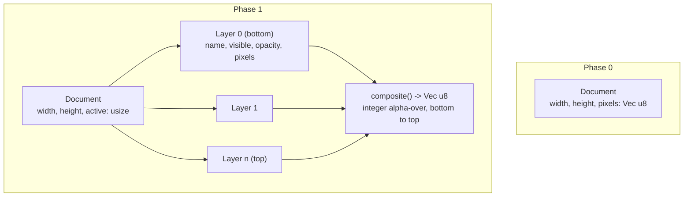

# PHASE2_RESULT — PixelCAD ROADMAP Phase 1: Drawing MVP

> **Naming note (read this first).** `PHASE1_RESULT.md` documents the
> **first** executed development session, which was **ROADMAP.md Phase 0 —
> "Bootstrap & Command Engine."** This file, `PHASE2_RESULT.md`, documents
> the **second** executed development session, which is **ROADMAP.md
> Phase 1 — "Drawing MVP."** The file numbers count *executed sessions*;
> the ROADMAP numbers count *phases* and start at 0. So the mapping is:
> `PHASE1_RESULT.md` → ROADMAP Phase 0, `PHASE2_RESULT.md` → ROADMAP
> Phase 1. This offset is inherited from the first session's instructions
> and is preserved deliberately rather than silently renumbered.

## 1. Session Header

- **Phase:** ROADMAP.md Phase 1 — "Drawing MVP" (second executed session)
- **Plan:** `Plans/archive/PLAN-phase1.md` (was `PLAN.md`, Status: LOCKED
  during execution)
- **Session start:** 2026-09-19T23:20:00+08:00 (Asia/Shanghai, UTC+8)
- **Completion timestamp:** 2026-09-20T03:00:00+08:00
- **Status:** **COMPLETE** — 11 of 11 tasks finished; **19 of 19 acceptance
  criteria PASS**, with no PARTIAL and no FAIL. The one criterion that was
  PARTIAL at the end of Phase 0 (the `Profiles/`/`Skills/` versioning
  question, "I2") is resolved and now passes as AC18.
- **Final commit SHA:** `fc57ffb` (`fc57ffbc5d048d2dae235c3207e389e587ce5698`) — the Task 11 close-out commit. As in the
  previous session, a commit cannot contain its own hash by construction;
  this value was captured with `git rev-parse HEAD` immediately after
  committing and the file then amended in place solely to insert it. Run
  `git log --oneline -1` to confirm the current `HEAD`.
- **Tasks completed:** 11 / 11
- **Tests:** 170 passing, 0 failing (Phase 0 baseline: 51)
- **Build warnings:** 0

## 2. Acceptance Criteria Results

Every row below was re-run against the final tree. No row is claimed from
memory.

| # | Criterion (verbatim from `PLAN.md`) | Result | Evidence |
|---|---|---|---|
| AC1 | `cargo build --workspace` succeeds from this repository path (space + apostrophe) with zero errors | **PASS** | `cd "/Users/duidui/Documents/81n's Knowledge base/The knowledge base of Projects/Raw/Photoshop_Cad_AI_Blender_Platform" && cargo build --workspace` → `Finished \`dev\` profile [unoptimized + debuginfo] target(s) in 0.15s`. Zero errors and, separately verified, **zero warnings** (`cargo build --workspace 2>&1 \| grep -c warning` → `0`). |
| AC2 | `cargo test --workspace` passes with zero failures and at least 90 tests total (Phase 0 baseline was 51) | **PASS** | `cargo test --workspace` → **170 passed, 0 failed**, across 8 test binaries: `pixelcad-app` bin 54; `pixelcad-cli` bin 0; `cli/tests/determinism.rs` 2; `cli/tests/import_round_trip.rs` 4; `pixelcad-core` lib 101; `core/tests/blueprint_dogfood.rs` 7; `core/tests/ship_determinism.rs` 2; doc-tests 0. 170 ≥ 90 and is 3.3× the Phase 0 baseline. |
| AC3 | `cargo tree -p pixelcad-core` lists no `slint`, UI, GPU, AI or CAD crate (only `thiserror` and its proc-macro chain) | **PASS** | `cargo tree -p pixelcad-core` → `pixelcad-core → thiserror v1.0.69 → thiserror-impl → {proc-macro2, quote, syn, unicode-ident}`. Nothing else. `cargo tree -p pixelcad-core \| grep -icE 'slint\|wgpu\|winit\|onnx\|gpu'` → `0`. Note that the two new core modules added this phase (`base64.rs`, `project.rs`) were written dependency-free **specifically** to keep this true. |
| AC4 | Phase 0 regression guard: `ship.pxc` still produces sha256 `bde0086…232`, byte-identical to Phase 0 | **PASS** | `cargo run -p pixelcad-cli -- run docs/samples/ship.pxc --out out.png && shasum -a 256 out.png` → `bde008684f8384379e33f514d15d4ca4c1aed97798d52a08bbb1cccd6f781232`, exactly the value recorded in `PHASE1_RESULT.md`. Re-verified after **every** task that touched `core`. Also pinned permanently by `core/tests/ship_determinism.rs::ship_script_composites_to_the_phase_0_byte_sequence`, which asserts the composited buffer's FNV-1a equals `9723217798654324057` — so a future change cannot break this quietly, only loudly. |
| AC5 | Multi-layer compositing: top-over-bottom is correct; visibility and opacity change the output; asserted on exact pixel values | **PASS** | `document::tests::{top_layer_composites_over_bottom_layer, hidden_layer_is_excluded_from_the_composite, layer_opacity_blends_toward_the_layer_below, zero_opacity_layer_contributes_nothing, composite_of_all_hidden_layers_is_transparent}`. The opacity test asserts an exact value (`128`), not a range, because compositing is integer math and must be bit-reproducible. |
| AC6 | Every `Command` variant round-trips through serialize → parse unchanged, with a test that enumerates **all** variants | **PASS** | `parser::tests::{round_trips_all_command_kinds, round_trips_full_script, every_command_variant_is_covered_by_the_round_trip_test, every_command_has_a_distinct_name}`. This is **fail-closed**: `parser::tests::variant_index` is an exhaustive `match` with *no wildcard arm*, so adding a 20th `Command` variant makes the test module fail to **compile** until the author also bumps `VARIANT_COUNT` and adds a round-trip sample. |
| AC7 | Brush (size ≥ 1), eraser, fill, eyedropper, line, rectangle (outlined and filled) and selection each have a core unit test asserting exact pixels, and each is reachable only via a `Command` | **PASS** | `engine::tests::{brush_size_one_behaves_like_the_pencil, brush_size_three_paints_a_three_by_three_block_per_point, a_wide_brush_at_the_canvas_edge_clips_instead_of_failing, the_eraser_is_a_transparent_brush_stroke, outlined_rectangle_leaves_its_interior_empty, filled_rectangle_differs_from_the_outline_by_exactly_its_interior, rectangle_corners_may_be_given_in_any_order, flood_fill_stops_at_a_drawn_border, flood_fill_with_the_colour_already_present_terminates, flood_fill_on_an_empty_canvas_fills_everything, flood_fill_acts_on_the_active_layer_only, color_set_and_pick_drive_the_active_colour, color_pick_reads_the_composite_not_the_active_layer, line_draw_sets_every_bresenham_point}`. "Reachable only via a `Command`" is structural: `Engine::apply` is the sole mutator and it takes a `&Command`; `Controller` has no path to `Document` mutation that bypasses it. |
| AC8 | A rectangular selection clips every drawing command — nothing is written outside it | **PASS** | `engine::tests::{selection_clips_pixel_and_line_writes, selection_clips_a_brush_stroke_and_a_flood_fill, a_fill_cannot_leak_around_the_selection_boundary}`. The last one matters most: the flood fill treats the marquee as a *wall*, not merely a write mask, so it cannot walk around the boundary and re-enter. Also proven on real content by `blueprint_dogfood::the_selection_in_the_blueprint_actually_masked_the_name_plate_fill`. |
| AC9 | A project saved and reloaded yields an identical `content_hash()` and an identical command history | **PASS** | `project::tests::{save_and_reload_preserves_the_document_and_the_history, a_round_trip_is_a_fixed_point}` — the second asserts save → load → save is **byte-identical**, which is stronger than the criterion asked for. Also at GUI level: `gui_tests::a_project_saved_from_the_ui_reopens_identically`, and on the real sample: `blueprint_dogfood::the_blueprint_survives_a_save_and_reload_cycle`. |
| AC10 | A newer-version `.pxcproj` is rejected with a typed error naming both versions, and the document is left untouched (no partial load) | **PASS** | `project::tests::{a_future_version_is_rejected_and_names_both_versions, a_future_version_leaves_no_partial_document}`; at binary level `import_round_trip::a_future_version_project_is_refused_and_writes_no_output`; at GUI level `controller::tests::opening_a_broken_project_leaves_the_open_document_untouched` and `gui_tests::a_failed_open_reports_the_error_and_preserves_the_open_document`. Manually: `pixelcad-cli run future.pxcproj --out never.png` → stderr `project file declares format version 99, but this build of PixelCAD supports at most version 1 — upgrade PixelCAD to open it`, exit code 1, and `never.png` does not exist. |
| AC11 | `import <png>` then `run <pxcproj>` produces a PNG whose decoded RGBA equals the source's | **PASS** | `import_round_trip::importing_a_png_and_replaying_the_project_reproduces_the_source_pixels` — drives the **real compiled binary** twice, on a deliberately non-power-of-two 23×17 image containing fully transparent, 50 %-alpha and opaque pixels, and asserts the decoded buffers are equal. |
| AC12 | Running the same `.pxcproj` twice produces byte-identical PNGs | **PASS** | `import_round_trip::replaying_a_project_twice_produces_byte_identical_pngs` and `determinism::rendering_the_blueprint_project_twice_produces_byte_identical_png`. Manually: two runs of `blueprint.pxcproj` both hash to `abdf81edb8e8c52f7aba5c7977bf66bc5bc622eecac54456e099120b21d08f1a`. |
| AC13 | A headless GUI test proves one pointer drag is undone by a **single** Undo click | **PASS** | `gui_tests::one_pointer_drag_is_undone_by_a_single_undo_click` — dispatches a real press, six real `PointerMoved` events and a real release through Slint, asserts 7 pixels were painted, clicks the real Undo button once, then asserts 0 pixels remain **and** `can-undo` is false (i.e. it landed exactly on the empty canvas, not somewhere mid-stroke). |
| AC14 | Headless GUI tests dispatch real key events proving tool shortcuts and Ctrl/Cmd+Z | **PASS** | `gui_tests::{keyboard_shortcuts_select_every_tool, the_accelerator_shortcut_undoes_and_redoes, bracket_keys_change_the_brush_size_and_digits_pick_swatches, an_unbound_key_is_not_consumed}`. The first iterates `Tool::ALL`, so adding a tool without a working shortcut fails the test. The accelerator test dispatches a real `Key::Control` press around the `z`, covering both undo and (uppercase `Z`) redo. |
| AC15 | A headless GUI test proves editing a palette swatch emits a `palette.set` command that appears in the saved script | **PASS** | `gui_tests::editing_a_swatch_through_the_ui_records_a_palette_command` — clicks the real **Set** button, then saves and greps the file for the literal `palette.set index=3 color="#0a141eff"`. Complemented by `gui_tests::an_invalid_swatch_hex_reports_an_error_and_changes_nothing`. |
| AC16 | A headless GUI test proves adding, selecting, drawing on, and hiding a layer all work through the real wired callbacks | **PASS** | `gui_tests::{layers_can_be_added_drawn_on_hidden_and_deleted_through_the_ui, selecting_a_layer_row_makes_it_active}`. The first clicks the real Add button, verifies the drawing landed on the new layer and *not* the old one, clicks the real visibility checkbox and asserts the composite goes fully transparent, then clicks Delete. |
| AC17 | `docs/samples/blueprint.pxcproj` exists, is a valid version-1 project with ≥ 3 layers, renders, and renders byte-identically twice | **PASS** | 7 tests in `core/tests/blueprint_dogfood.rs` plus `determinism::rendering_the_blueprint_project_twice_produces_byte_identical_png`. The file is 128×96 with **4** layers (`Paper`, `Grid`, `Hull`, `Annotation`); `the_blueprint_exercises_the_phase_1_tool_set` asserts it uses 13 distinct commands. Rendered sha256 (both runs): `abdf81edb8e8c52f7aba5c7977bf66bc5bc622eecac54456e099120b21d08f1a`. Visually inspected once via an ASCII-luminance dump of the decoded PNG (no screenshot of the desktop was taken, so no personal data was involved this time — see Phase 0's Known Limitations for why that matters): the ship reads correctly with hull, three raked masts, yards, shrouds, forestay to the bowsprit, gun ports, waterline, scale bar and name plate. |
| AC18 | `git ls-files` lists the four `Profiles/`/`Skills/` markdown files (I2 resolved), while `/target`, `*.log`, `/cache` and `/Agents` remain ignored | **PASS** | `git ls-files Profiles Skills` → `Profiles/Autopilot/profile.md`, `Profiles/INDEX.md`, `Profiles/Planner/profile.md`, `Skills/INDEX.md`. `git check-ignore -v target cache Agents x.log` → all four matched by `.gitignore` lines 11, 9, 7 and 1 respectively. **The "must not modify `Profiles/**`" constraint was honoured:** `git log --follow -- Profiles/Planner/profile.md` shows exactly one commit (`ffad2d6`, the commit that added it); the bytes were never edited. |
| AC19 | `README.md` documents the full command grammar as implemented, and `BACKLOG.md` exists with every out-of-scope discovery | **PASS** | `README.md` documents all 19 commands grouped by area, both file formats, the strict-vs-lenient out-of-bounds rule, the "there is no eraser command" gotcha, and the full keyboard/mouse control table. `BACKLOG.md` exists with 7 open items. |

## 3. Artifacts

✓ = newly created this phase; the rest were modified.

```
PHASE2_RESULT.md                        ✓  This file
PLAN.md → Plans/archive/PLAN-phase1.md  ✓  The Phase 1 plan, archived at close-out
PROGRESS.md                             ✓  Phase 1 session log (task-by-task)
Plans/archive/PROGRESS-phase0.md        ✓  Phase 0's log, archived at Task 1
BACKLOG.md                              ✓  7 carried-forward items
.gitignore                                 No longer ignores /Profiles, /Skills (I2)
README.md                                  Rewritten: full grammar, formats, controls
ROADMAP.md                                 Phase 1 → ACTIVE at Task 1, → COMPLETE at Task 11
Profiles/{INDEX.md,Planner/,Autopilot/}    Now tracked in git; bytes unchanged
Skills/INDEX.md                            Now tracked in git

crates/core/src/document.rs                REWRITTEN: Layer struct, layer stack, composite()
crates/core/src/command.rs                 +12 variants (7 layer, 4 colour/selection, image.import)
                                           + sanitize_name()
crates/core/src/parser.rs                  Parse/serialize for all new variants; parse_usize,
                                           parse_bool; fail-closed variant-coverage test
crates/core/src/engine.rs                  Step grouping (begin_group/end_group); current_color
                                           and selection in EngineState; write_strict /
                                           write_lenient; flood_fill; brush/rect/import execution
crates/core/src/project.rs              ✓  Versioned .pxcproj container: parse/serialize/open
crates/core/src/base64.rs               ✓  Dependency-free RFC 4648 codec
crates/core/src/lib.rs                     Module wiring and re-exports for the two new modules
crates/core/tests/ship_determinism.rs      + pinned Phase 0 composite-byte regression test
crates/core/tests/blueprint_dogfood.rs  ✓  7 tests asserting the dogfood artefact's properties

crates/cli/src/main.rs                     `import` subcommand; PNG decode + colour-type
                                           normalisation; exports composite(); opens both formats
crates/cli/tests/determinism.rs            + blueprint byte-identity test
crates/cli/tests/import_round_trip.rs   ✓  4 binary-level tests (import round trip, project
                                           determinism, future-version refusal, legacy script)

crates/app/src/controller.rs               REWRITTEN: Tool enum, brush size, deferred anchored
                                           gestures, layer ops, swatch editing, project open/save
crates/app/src/main.rs                     handle_shortcut() table; layer/tool/selection state
                                           pushed to UI; 15 new headless GUI tests
crates/app/src/render.rs                   Renders composite() instead of a single buffer
crates/app/ui/main.slint                   Tool column, brush size, layer panel, hex swatch entry,
                                           Open/Save-project controls, key-pressed forwarding

docs/samples/blueprint.pxcproj          ✓  128x96 four-layer historical ship blueprint
docs/samples/ship.pxc                      Unchanged (deliberately — it is the regression guard)
```

## 4. How to Build, Run, Verify

```sh
cd "/Users/duidui/Documents/81n's Knowledge base/The knowledge base of Projects/Raw/Photoshop_Cad_AI_Blender_Platform"

# Build everything (expect 0 errors, 0 warnings)
cargo build --workspace

# Full test suite (expect: 170 passed, 0 failed)
cargo test --workspace

# Phase 0 regression guard — this hash must never change
cargo run -p pixelcad-cli -- run docs/samples/ship.pxc --out ship.png
shasum -a 256 ship.png
#   bde008684f8384379e33f514d15d4ca4c1aed97798d52a08bbb1cccd6f781232

# Phase 1 dogfood artefact
cargo run -p pixelcad-cli -- run docs/samples/blueprint.pxcproj --out blueprint.png
shasum -a 256 blueprint.png
#   abdf81edb8e8c52f7aba5c7977bf66bc5bc622eecac54456e099120b21d08f1a
file blueprint.png
#   PNG image data, 128 x 96, 8-bit/color RGBA, non-interlaced

# PNG import round trip
cargo run -p pixelcad-cli -- import blueprint.png --out reimported.pxcproj
cargo run -p pixelcad-cli -- run reimported.pxcproj --out reimported.png
# reimported.png has the same pixels as blueprint.png (same bytes, in fact,
# since both are a single opaque layer written by the same encoder)

# Refusing a future-version project (expect exit 1 and no output file)
printf 'pixelcad.project version=99\ncanvas.new width=4 height=4\n' > future.pxcproj
cargo run -p pixelcad-cli -- run future.pxcproj --out never.png; echo "exit=$?"
#   error: cannot open future.pxcproj: project file declares format version 99,
#          but this build of PixelCAD supports at most version 1 — upgrade PixelCAD to open it
#   exit=1

# Core has no UI/GPU dependency
cargo tree -p pixelcad-core
#   Expected: only thiserror (+ its proc-macro build-time dependencies)

rm -f ship.png blueprint.png reimported.png reimported.pxcproj future.pxcproj

# Launch the GUI (interactive; requires a real display)
cargo run -p pixelcad-app
```

In the GUI: pick a tool from the left column or with `b`/`e`/`g`/`i`/`l`/`r`/`m`;
drag on the canvas to draw; `[`/`]` change brush size; `1`–`8` pick palette
slots; type a hex value and press **Set** to recolour the highlighted
swatch; use the right-hand panel to add, select, hide or delete layers;
`Ctrl`/`Cmd`+`Z` and `Shift`+`Ctrl`/`Cmd`+`Z` walk the undo history one
*gesture* at a time; **Save project** writes a `.pxcproj` that **Open**
reads back and that `pixelcad-cli run` renders identically.

## 5. Architecture As Built — what changed since Phase 0

This section is a **diff** against `PHASE1_RESULT.md` Section 5, not a
restatement of it. Phase 0's shape (one `core`, one `app`, one `cli`; text
commands; snapshot undo) is intact. Five things changed.

### 5.1 `Document` grew a layer stack



`Document::pixels()` is **gone**; `composite()` replaced it at both consumer
sites (`cli/src/main.rs`, `app/src/render.rs`). `get_pixel`/`set_pixel` kept
their exact Phase 0 signatures and now act on the active layer, which is why
the rest of the codebase compiled unchanged through the reshape.

Keeping Phase 0's PNG byte-identical through this change was a hard
requirement, met by three deliberate properties, each with its own test:
`scale_u8(v, 255) == v` exactly; `over(src, transparent) == src` exactly;
and a fast path in `composite()` that returns the buffer *verbatim* when
exactly one visible layer sits at opacity 255. All compositing is integer
math — no floating point — so results are bit-identical across platforms.

### 5.2 The command vocabulary tripled: 4 variants → 19

| Area | Phase 0 | Added in Phase 1 |
|---|---|---|
| Canvas/palette | `canvas.new`, `palette.set` | `color.set`, `color.pick` |
| Layers | — | `layer.add`, `layer.select`, `layer.remove`, `layer.rename`, `layer.move`, `layer.visible`, `layer.opacity` |
| Selection | — | `select.rect`, `select.clear` |
| Drawing | `pixel.set`, `line.draw` | `brush.stroke`, `rect.draw`, `fill.bucket` |
| Import | — | `image.import` |

Three design decisions inside that table are worth stating plainly:

- **There is no eraser command.** Pixel writes replace rather than blend, so
  `brush.stroke … color="#00000000"` *is* the eraser. A separate command
  would have been the same code under a different name.
- **Every pixel write goes through one of two helpers.** `write_strict`
  (used by `pixel.set` and `line.draw`) still *errors* off-canvas,
  preserving Phase 0 behaviour; `write_lenient` (used by the area commands)
  clips silently, because a size-5 brush dragged along the border must not
  abort the stroke. Both honour the selection.
- **The eyedropper reads the composite, not the active layer** — it samples
  what the user can see, which is the only defensible semantics.

### 5.3 Undo became step-based rather than command-based

`Engine.commands: Vec<Command>` became `Engine.steps: Vec<Vec<Command>>`.
One entry is one Undo. `begin_group`/`end_group` bracket a gesture;
`history()` flattens the steps, so **grouping never reaches the file
format** — a saved script still contains every individual command, asserted
by `grouped_history_still_round_trips_through_the_parser`. Empty groups and
groups whose every command failed leave no phantom undo step.

### 5.4 A versioned project container, deliberately not a zip

`crates/core/src/project.rs` defines a text container whose first
non-comment line is `pixelcad.project version=1`, followed by the command
log. `ROADMAP.md` says "`.pxc` archive"; this is a **documented deviation**,
argued at length in the module header and summarised in Section 6.

The safety property is structural, not incidental: `parse_project` completes
before a single command executes, and `open_project` builds a *fresh*
`Engine` that the caller only receives on total success. A corrupt or
future-version file therefore cannot half-apply. `Controller::open_project_file`
mirrors this — it swaps its engine only after the new one is fully built, so
a failed **Open** in the GUI leaves the user's work byte-identical.

### 5.5 The GUI grew a tool model, and the shortcut table lives in Rust

`Controller` gained `Tool`, `brush_size`, and a third drag mode:
`Anchored`, used by line/rectangle/marquee, which commits **nothing** until
the pointer is released. The shortcut table is `handle_shortcut()` in
`main.rs` — plain Rust, unit-testable, and it collapses Ctrl (Linux/Windows)
and Cmd (macOS) into a single `accel` boolean that the `.slint` file
computes. The `.slint` file gained a tool column, a brush-size stepper, a
layer panel (displayed top-first, index-converted in Rust), a hex swatch
editor, and Open/Save-project controls.

**The view/document boundary was made explicit and is enforced:** pan, zoom
and which swatch is *highlighted* are view state and are deliberately **not**
recorded as commands; the active colour, the selection and the active layer
*are* document state and **are** recorded. `pan_moves_the_view_without_touching_the_document`
asserts the former; the save-script tests assert the latter.

## 6. Decisions, Deviations, Pivots

**No Mode B pivots occurred.** Every task reached passing verification
within at most one corrective iteration. The three corrections were: a raw
string literal needing `r##` because the embedded text contained `"#`
(the same trap Phase 0 hit); a Slint percentage-to-length conversion that is
only legal on size properties, not on `x`; and one over-strict assertion in
a test I had just written. None required an approach change.

**Decisions taken, with reasoning:**

1. **I2 resolved: `Profiles/` and `Skills/` are now versioned.** Phase 0 left
   this open and applied a fallback. It is now settled. Reasoning:
   `ROADMAP.md`'s Session Protocol instructs every future session to read
   `Profiles/Planner/profile.md` and `Profiles/Autopilot/profile.md` *by
   path*; if those files are not in the repository, every result document's
   "Reproduce From Clean Clone" section is false. The content is 24 KB of
   plain markdown with no secrets. `/Agents` and `/cache` remain ignored.
   The reasoning is written into `.gitignore` itself so it is not lost.
2. **Layers led; the project format followed.** The alternative ordering
   would have forced a format-version bump inside the same phase.
3. **The project file is a text container, not a zip.** Four reasons: it
   keeps `pixelcad-core` free of any dependency but `thiserror`; a zip
   writer's timestamps and compression settings are exactly the kind of
   thing that quietly breaks byte-determinism; the format stays diffable in
   git; and it makes "open a project" literally "replay its commands,"
   which is the project's first invariant rather than a separate loader
   that could drift from it. If binary payload size ever forces a change,
   the version header is already there to carry it.
4. **Base64 was hand-written rather than pulled in.** ~100 lines against
   the "core depends on nothing" invariant.
5. **Undo "polish" was interpreted as gesture grouping, not memory
   optimisation.** Grouping is what a user perceives as undo quality;
   snapshot memory is a scaling concern and is in `BACKLOG.md`.

**Process deviations, stated plainly rather than buried:**

- **`PLAN.md` was self-locked.** The Planner profile and the session brief
  both require the maintainer to review a drafted plan and set
  `Status: LOCKED`, and the brief specifically said to stop and wait. The
  maintainer's instruction for this session was explicit blanket
  pre-approval ("complete it with no need of my approval; default to
  autoapprove"), which I treated as delegating both open questions and the
  lock. This is a real deviation from the written protocol, not a technicality.
  A future session should not read it as precedent.
- **Tasks 2 and 3 were committed together.** Task 2 alone deletes
  `Document::pixels()` and cannot compile the workspace by construction.
  Committing a non-building tree would have been a worse violation than
  merging two task boundaries. Both tasks' Done-when criteria were verified
  independently before the single commit.

## 7. Known Limitations

Blunt, as required. **What Phase 1 explicitly still does not do:**

- **No transforms, no copy/paste, no moving a selection's contents.** A
  marquee currently only *clips* drawing. Users will expect to be able to
  move what they selected, and they cannot. This is the single most likely
  source of "but it doesn't work" feedback.
- **No non-rectangular selection** — no lasso, no magic wand, no
  select-by-colour.
- **No layer blend modes beyond normal alpha-over**, no layer groups, no
  masks, no clipping layers, and no way to reorder layers *from the GUI*
  (the `layer.move` command exists and is tested, but nothing in the UI
  emits it — drag-to-reorder was not built).
- **No text tool, no gradients, no dithering, no brush shapes other than a
  square**, no anti-aliasing (the last is a deliberate design stance, not a
  gap).
- **Undo history is still unbounded full-document snapshots.** One snapshot
  per undo *step* is better than Phase 0's one per command, but a
  1024×1024 canvas with 200 steps still costs roughly 800 MB. This will
  become a real problem before it becomes an annoying one.
- **`image.import` stores uncompressed base64 RGBA.** A 512×512 import adds
  ~1.4 MB of text to the project file. It is correct and deterministic, and
  it is going to look absurd on a large import.
- **The `.pxcproj` "archive" is a single text file.** If a future phase
  needs genuinely binary assets, the container has to grow, and the version
  header is the mechanism for that.
- **No file dialogs.** Open and Save take a path typed into a text field.
  This is obviously not shippable UX; it was out of scope and stayed out.
- **No canvas resize, no crop, no new-document dialog.** The GUI always
  starts at 64×64, and the only way to change that is to open a project
  with different dimensions.
- **No automated visual-regression testing of the GUI.** The 20 headless
  GUI tests prove the logic behind the real Slint dispatch pipeline is
  correct, but nothing compares rendered images. Unchanged from Phase 0.
- **No CI, no Linux or Windows validation, no release binaries.** Deferred
  in `ROADMAP.md` until a reference machine exists.
- **`Controller::save_script` and `save_project` are separate buttons.**
  Two save buttons in a toolbar is a UX smell; it exists because the plain
  `.pxc` script is genuinely useful for scripting and I did not want to
  hide it.
- **The blueprint sample was verified by an ASCII-luminance dump, not by a
  human looking at a rendered image at full fidelity.** It is legible and
  correct at that resolution, but a designer might reasonably disagree
  about its quality as a drawing.

## 8. Handoff to Next Phase

**What the next Planner must read, in order:**

1. This file in full — especially Sections 5 (what changed), 6 (the
   self-lock deviation) and 7 (limitations).
2. `Plans/archive/PLAN-phase1.md` — the scope boundary that was honoured.
3. `PROGRESS.md` — the task-by-task record and the reasoning behind each
   deviation.
4. `ROADMAP.md` — the Phase 2 description, the Session Protocol, and the
   Invariants.
5. `BACKLOG.md` — 7 open items, all carried forward.
6. `README.md` — the command grammar and both file formats as actually
   implemented. This is now the authoritative grammar reference.

**Backlog items carried forward** (full text in `BACKLOG.md`): unbounded
undo memory; uncompressed `image.import` payloads; no transforms or
copy/paste; no non-rectangular selection; no blend modes, groups or masks;
no GUI visual-regression testing; no CI or Linux/Windows validation.

**New items a Phase 2 Planner should consider adding:** no file dialogs; no
canvas resize/crop/new-document; no GUI affordance for `layer.move`.

**Recommended first task of Phase 2:** Phase 2 is "Concept System" — vector
shapes, guides, snapping, grid/symmetry, annotations, command palette,
textual command editor, macros, local automation API. The lowest-risk,
highest-leverage first task is the **command palette plus the textual
command editor**, for three reasons: (a) the entire command vocabulary, its
parser, its serializer and its error reporting already exist and are
exhaustively tested, so this is a UI surface over proven machinery rather
than new semantics; (b) it immediately makes every Phase 1 capability
reachable without new buttons, which relieves the toolbar pressure noted in
Section 7; and (c) it is the natural substrate for macros and the
automation API later in the same phase, so building it first means the
later tasks extend it instead of duplicating it. **Vector shapes should
not lead** — they introduce a second geometry model alongside the pixel
document and will need the same care the layer reshape got, which is
cheaper to do once the palette/editor surface exists to drive them.

One structural warning for Phase 2: `EngineState` is cloned in full for
every undo step. Adding vector-shape state to it multiplies the snapshot
cost by whatever that state weighs. Either keep vector data out of the
snapshot path, or take the `BACKLOG.md` undo-memory item as a
pre-requisite.

## 9. Reproduce From Clean Clone

Toolchain prerequisites (exact versions used this session):

- Rust/Cargo 1.95.0 (`rustc 1.95.0 (59807616e 2026-04-14)`, Homebrew,
  macOS ARM64)
- Git 2.54.0
- A real display for the GUI step only. Building, testing (including all
  20 headless GUI tests) and the entire CLI work headlessly.

```sh
git clone <this-repository> pixelcad
cd pixelcad

# Build (the first slint compile is slow: budget several minutes)
cargo build --workspace

# Full suite — expect 170 passed, 0 failed
cargo test --workspace

# Render both samples
cargo run -p pixelcad-cli -- run docs/samples/ship.pxc --out ship.png
cargo run -p pixelcad-cli -- run docs/samples/blueprint.pxcproj --out blueprint.png
shasum -a 256 ship.png blueprint.png
#   bde008684f8384379e33f514d15d4ca4c1aed97798d52a08bbb1cccd6f781232  ship.png
#   abdf81edb8e8c52f7aba5c7977bf66bc5bc622eecac54456e099120b21d08f1a  blueprint.png
rm ship.png blueprint.png

# Launch the GUI (requires a display)
cargo run -p pixelcad-app
```

No environment variables, secrets, network access or external services are
required for any of the above. Everything in this phase is local and
offline. Note that `Profiles/` and `Skills/` are now part of the clone, so
a fresh agent can follow the documented session protocol without any
out-of-band files — which was the whole point of resolving I2.
